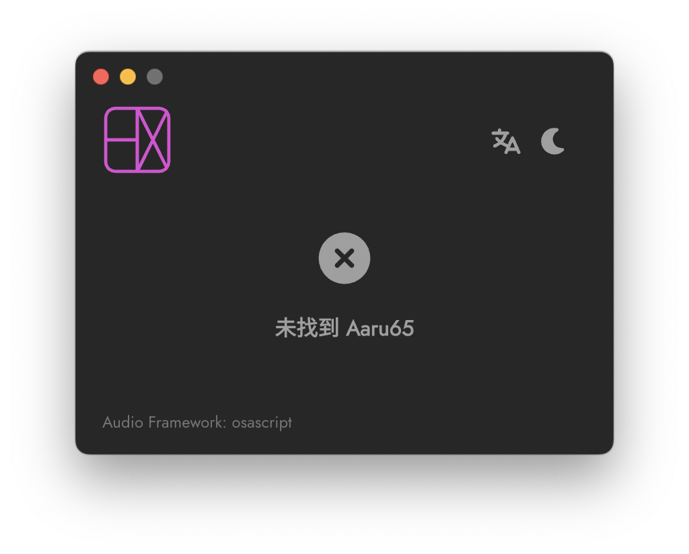

{/* truncate */}

## <Icon icon="fa-solid fa-newspaper" style={{color: "#DDDDDD",}} /> &nbsp; 简介 {#introduction}

Aaru65 Controller 驱动程序能让你直接将 Aaru65 上的圣甲虫滑块映射到系统音量控制，完全无需再通过 Midi Mixer。
* 实现滑块到系统音量的线性映射 
* 跨平台使用，包括：

  * Windows x64

  * macOS (Apple Silicon)

## <Icon icon="fa-solid fa-file-arrow-down" style={{color: "#DDDDDD",}} /> &nbsp; 下载及安装 {#download-and-installation}

根据你的系统下载对应的 Aaru65 Controller 安装程序：

| 来源 | <Icon icon="fa-brands fa-windows" /> Windows | <Icon icon="fa-brands fa-apple" /> macOS |
| --- | --- | --- |
| MuseTransfer | <Icon icon="fa-solid fa-circle-down" />[下载](https://musetransfer.com/s/47otuqi0m) | <Icon icon="fa-solid fa-circle-down" />[下载](https://musetransfer.com/s/pzs20kno7) |
| GoogleDrive | <Icon icon="fa-solid fa-circle-down" />[下载](https://drive.google.com/file/d/1Izk-Fg5NaIUl7vJ5qCgE9l46pxTroWIv/view?usp=drive_link) | <Icon icon="fa-solid fa-circle-down" />[下载](https://drive.google.com/file/d/1fZ8_5Ee2iGALDeyAmFmARCQm6UBXckNY/view?usp=drive_link) |

下载完成后，请打开安装程序：

* Windows： 根据提示点击“下一步”完成安装。

* macOS：将应用程序拖入“应用程序”文件夹。

:::info
macOS 用户提示：如果显示“无法打开”，请在应用程序图标上右键，然后选择“打开”。
:::

## <Icon icon="fa-solid fa-gamepad" style={{color: "#DDDDDD",}} /> &nbsp; 使用方法 {#usage-manual}

### 基础设置 {#basic-settings}

首先确保滑块处于“MIDI”模式：

<Icon icon="fa-solid fa-hashtag" style={{color: "#cc9e75",}} /> <Icon icon="fa-solid fa-1" style={{color: "#cc9e75",}} /> &nbsp;连接 USB 数据线，前往 [via.helix.site](https://via.helix.site)，然后点击 `Authorize Device`，在弹出窗口中选择 `AARU 65`。如果该网页出错，请更换为 Chrome 或者 Edge 浏览器。

<Icon icon="fa-solid fa-hashtag" style={{color: "#cc9e75",}} /> <Icon icon="fa-solid fa-2" style={{color: "#cc9e75",}} /> &nbsp;如下图所示，点击长箭头所指处的 <Icon icon="fa-solid fa-microchip" /> 图标。

<Icon icon="fa-solid fa-hashtag" style={{color: "#cc9e75",}} /> <Icon icon="fa-solid fa-3" style={{color: "#cc9e75",}} /> &nbsp;如下图所示，将短箭头所指处的下拉菜单选项改为“MIDI”，并确保下方的 “MIDI Channel”和“MIDI CC”值都为 0。

### 主界面

打开 Aaru65 Controller 主界面，并连接你的 Aaru65，如果未连接会提示“未找到 Aaru65”：

连接 Aaru65 后，你会在界面上看到一个蓝色滑条，它显示了圣甲虫滑块的当前位置。你可以尝试移动圣甲虫滑块，并观察界面上的蓝色滑条是否同步变化。

如果蓝色滑条没有变化，可能意味着你没有进行 [基础设置](/blog/aaru65_controller_help#basic-settings)。

蓝色滑条不仅反映了圣甲虫滑块的位置，同时也与系统音量关联。系统音量会随着圣甲虫滑块的移动而同步改变。

### 后台运行

关闭主界面后，软件会继续在后台运行。要完全退出软件，请在系统托盘（Windows）或菜单栏（macOS）中，右键点击软件图标并选择退出。

### 开机自启动

开机自启动选项可以在系统托盘（Windows）或菜单栏（macOS）中，右键点击软件图标找到。