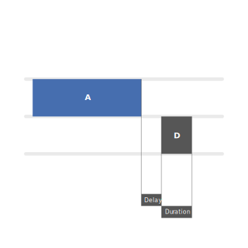
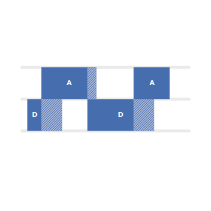
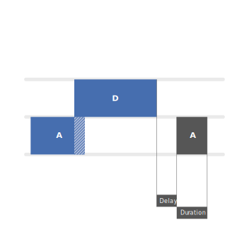
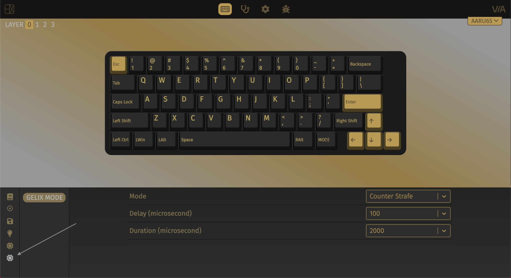

import Tabs from '@theme/Tabs';
import TabItem from '@theme/TabItem';

## <Icon icon="fa-solid fa-newspaper" style={{color: "#DDDDDD",}} /> &nbsp; 更新内容 {#updated-content}

* 将 1.1.0g 中的 Gelix 功能迁入至此版本，并扩展为三种情景模式，详见 [Gelix 教程](/blog/aaru65_firmware_1_2_0#gelix-tutorial)。
* 内核迁移到 QMK Firmware 0.25.0。

## <Icon icon="fa-solid fa-file-arrow-down" style={{color: "#DDDDDD",}} /> &nbsp; 固件下载及更新方法 {#update-tutorial}

### 下载

根据你的 PCB 型号下载对应的固件：

<Tabs queryString="pcb-variant">
  <TabItem value="hotswap" label="热插拔" default>

    | 固件版本 | 备注 |
    |---|---|
    | <Icon icon="fa-solid fa-circle-down" /> [`1.2.0`](./helixlab_aaru65_hotswap_1.2.0.uf2) | <Icon icon="fa-solid fa-minus" /> |

  </TabItem>
  <TabItem value="soldered" label="焊接">
    
    | 固件版本 | 备注 |
    |---|---|
    | <Icon icon="fa-solid fa-circle-down" /> [`1.2.0`](./helixlab_aaru65_soldered_1.2.0.uf2) | <Icon icon="fa-solid fa-minus" /> |

  </TabItem>
</Tabs>

### 更新方法

<Icon icon="fa-solid fa-hashtag" style={{color: "#cc9e75",}} /> <Icon icon="fa-solid fa-1" style={{color: "#cc9e75",}} /> &nbsp;断开键盘与电脑之间的 USB 数据线连接。

<Icon icon="fa-solid fa-hashtag" style={{color: "#cc9e75",}} /> <Icon icon="fa-solid fa-2" style={{color: "#cc9e75",}} /> &nbsp;按住键盘上的 <kbd>**esc**</kbd> 键，同时用 USB 数据线把键盘连接至电脑，然后松开 <kbd>**esc**</kbd> 键。

<Icon icon="fa-solid fa-hashtag" style={{color: "#cc9e75",}} /> <Icon icon="fa-solid fa-3" style={{color: "#cc9e75",}} /> &nbsp;此时电脑上会弹出用于烧录固件的 U 盘，盘符为 `RPI-RP2`，将固件拖入此 U 盘，复制完成后 U 盘会自动弹出，更新即可完成。

<Icon icon="fa-solid fa-hashtag" style={{color: "#cc9e75",}} /> <Icon icon="fa-solid fa-4" style={{color: "#cc9e75",}} /> &nbsp;如果键盘没有自动恢复工作状态，请拔出 USB 数据线，然后重新连接 USB 数据线即可。

:::warning

固件更新后，键盘上存储的个人设置将被全部还原为初始状态，例如滑块、RGB 矩阵、自定义键值等，你可在稍后重新设置。

:::

## <Icon icon="fa-solid fa-gamepad" style={{color: "#DDDDDD",}} /> &nbsp; Gelix 教程 {#gelix-tutorial}

目前，Gelix 提供三种模式：

### 反向

反向（Counter Strafe）用于模拟一种常用的战斗技巧。其效果是，当你释放 <kbd>**A**</kbd> 键后，会自动按下 <kbd>**D**</kbd> 键；当你释放 <kbd>**D**</kbd> 键后，会自动按下 <kbd>**A**</kbd> 键；自动按键的时延和按下时长可由 `Delay` 和 `Duration` 两个参数自定义。

下图是按下 <kbd>**A**</kbd> 键后的可视化图表：

### 互斥

互斥（Mutex）使两个键互相覆盖且永远不能同时被激活。其效果是，当你按下 <kbd>**A**</kbd> 键后，会立即释放 <kbd>**D**</kbd> 键；而按下 <kbd>**D**</kbd> 键后，会立即释放 <kbd>**A**</kbd> 键。

下图是这种机制的可视化图表：

斜线部分表明该键在物理上未被释放，但电脑认为已经释放。

### 混合

混合（Hybrid）即同时拥有反向和互斥功能。

下图是这种机制的可视化图表：

### 启用 Gelix

Gelix 模式需要按 <kbd>**fn**</kbd>+<kbd>**G**</kbd> 键手动激活，再次按下则关闭 Gelix。

### 设置 Gelix

在未经设置的情况下，Gelix 默认为反向模式。

你可以使用 [VIA](https://via.helix.site) 设置 Gelix 的各项参数，则按下 <kbd>**fn**</kbd>+<kbd>**G**</kbd> 后会启用你所设置的方案。Aaru65 拥有板载存储，因此只需设置一次。

#### 步骤

<Icon icon="fa-solid fa-hashtag" style={{color: "#cc9e75",}} /> <Icon icon="fa-solid fa-1" style={{color: "#cc9e75",}} /> &nbsp;连接 USB 数据线，前往 [via.helix.site](https://via.helix.site)，然后点击 `Authorize Device`，在弹出窗口中选择 `AARU 65`。如果该网页出错，请更换为 Chrome 或者 Edge 浏览器。

<Icon icon="fa-solid fa-hashtag" style={{color: "#cc9e75",}} /> <Icon icon="fa-solid fa-2" style={{color: "#cc9e75",}} /> &nbsp;如下图所示，点击箭头所指处的 <Icon icon="fa-solid fa-microchip" /> 图标。

<Icon icon="fa-solid fa-hashtag" style={{color: "#cc9e75",}} /> <Icon icon="fa-solid fa-3" style={{color: "#cc9e75",}} /> &nbsp;在此页面下，你可以设置模式、Delay 以及 Duration 参数。