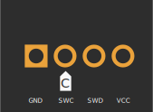

## 软件准备 {#software-prepare}

我们需要用 J-Link 为无线模块烧录固件，请安装：

* [**JLink v7.94c**](https://www.123pan.com/s/teb2jv-oMR2A.html)（若已安装则忽略）。

安装完成后，打开 `JFlashLite.exe`。

## 固件下载 {#download-firmware}

以下为 Elysium 2.4G 接收器的无线模块固件，下载后存放在本地。烧录前请仔细核对文件名，不要烧错。

| <Icon icon="fa-brands fa-bootstrap" /> 主控-ST STM32L433 Bootloader | 备注 |
|---|---|
| <Icon icon="fa-solid fa-circle-down" /> [`1.0.0`](https://cdn.shopify.com/s/files/1/0444/8259/2928/files/helix_nrf52840_ankh_1.0.0.hex?v=1727790535) | <Icon icon="fa-solid fa-minus" /> |

## 烧录 bootloader {#flash-bootloader}

:::warning

* J-Link 连接到接收器时，接收器须插入 USB 口，否则将无法识别到主控。

:::

* 把 J-Link 连接到主板上的烧录口。烧录口线序如下图所示：

> 方块焊盘为 GND，带 <Icon icon="fa-solid fa-copyright" /> 标记的焊盘为 SWC

* 如下图所示，打开 `JFlashLite.exe`，然后在“Device”一栏中选择 `nRF52840_xxAA`。然后点击“OK”。

* 在“Data File (bin /hex /mot/ srec/ ...)”一栏中选择无线模块固件文件所在的路径，然后点击“Program Device”。

## 与主板配对 {#flash-mcu-firmware}

* 请根据[热插拔主板 工厂刷机流程](/confidential/elysium-hotswap#pair-with-dongle)页面执行配对操作。