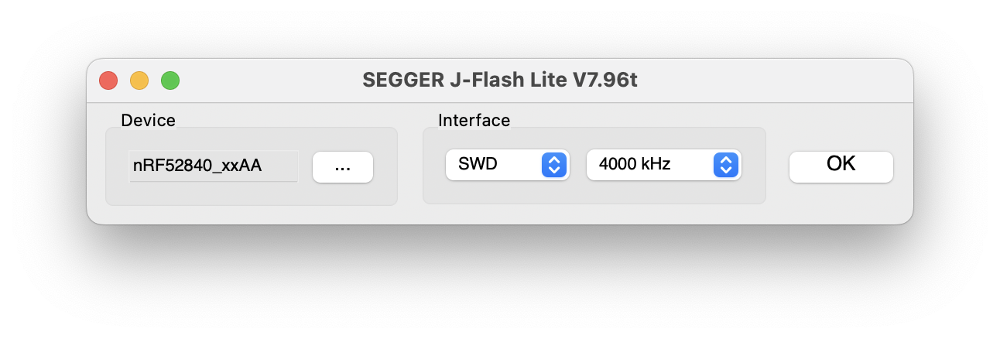

## 软件准备 {#software-prepare}

我们需要用 J-Link 为无线模块烧录固件，请安装：

* [**JLink v7.94c**](https://www.123pan.com/s/teb2jv-oMR2A.html)（若已安装则忽略）。

安装完成后，打开 `JFlashLite.exe`。

此外，还需要用 QMK Toolbox 为主控烧录固件，请安装：

* [**QMK Toolbox**](https://www.123pan.com/s/teb2jv-sMR2A.html)（若已安装则忽略）。

## 固件下载 {#download-firmware}

以下为 Elysium 热插拔的无线模块固件和主控固件，下载后存放在本地。烧录前请仔细核对文件名，不要烧错。

| <Icon icon="fa-brands fa-bluetooth" /> 无线模块-Nordic nRF52840 | <Icon icon="fa-solid fa-microchip" /> 主控-ST STM32L433 | 备注 |
|---|---| --- |
| <Icon icon="fa-solid fa-circle-down" /> [`1.0.0`](https://cdn.shopify.com/s/files/1/0444/8259/2928/files/helix_nrf52840_elysium_1.0.0.hex?v=1727787348) | <Icon icon="fa-solid fa-circle-down" /> [`1.0.2`](https://cdn.shopify.com/s/files/1/0444/8259/2928/files/helix_elysium_hotswap_1.0.2.bin?v=1727775881) | <Icon icon="fa-solid fa-minus" /> |

## 烧录 nRF 无线模块固件 {#flash-wireless-module-firmware}

:::warning

* J-Link 连接到 Elysium 时， Elysium 须处于通电状态（有 3.3V），否则将无法识别到无线模块，因此请连接 USB 小板，然后通过USB 为 Elysium 主板供电（用电池也可）。

* 主板的右半部分不连接也不会影响烧录。

:::

* 把 J-Link 连接到主板上的烧录口。烧录口线序如下图所示：

> 方块焊盘为 GND，带 <Icon icon="fa-solid fa-copyright" /> 标记的焊盘为 SWC

* 如下图所示，打开 `JFlashLite.exe`，然后在“Device”一栏中选择 `nRF52840_xxAA`。然后点击“OK”。

* 在“Data File (bin /hex /mot/ srec/ ...)”一栏中选择无线模块固件所在的路径，然后点击“Program Device”，第一次烧录的空片可能会提示有锁，点击解锁即可。

## 与接收器配对 {#pair-with-dongle}

:::warning

* 配对时只让一块主板和一个接收器通电，防止乱配。配对好之后要把主板和接收器存放在一起，以免弄乱或丢失。

* 配对接收器的时候并不需要烧录主控 STM32 固件，因为配对全由无线模块自行处理，但测试按键的话就需要烧录主控固件。

:::

* 如下图所示，把 PCB 正面的三挡开关拨到 2G4 档位，即拨到**最下方**，然后通电。
 <Icon icon="fa-solid fa-circle-exclamation" /> 这一步很重要，开关档位必须位于 2G4，否则会把接收器配对到蓝牙档位上，导致用户操作逻辑变反。

* 再把烧录好接收器固件的接收器插上电脑，接收器上的 LED 从呼吸变为常亮，即配对成功。 
 <Icon icon="fa-solid fa-circle-exclamation" /> 完成后，把三挡开关档位调到中间。交付给用户时，档位要保持在中间。

  
 <Icon icon="fa-solid fa-file-circle-question" /> 怎么重新配对

如果发生档位配错或者丢失接收器，则主板端和接收器端都需要擦除记忆，请按如下的操作清除两端的记忆:

主板端：连接 J-Link，打开 `JFlashLite.exe`，点击“ Erase Chip”将模块写为空片，然后按上方教程再烧录一次无线模块固件。

接收器端：快速按两下板子上的按钮，LED 变为快速闪烁，然后再快速按两下，LED 变为呼吸，则清除了记忆。

## 烧录 STM32 主控固件 {#flash-mcu-firmware}

* 按住 PCB 背面的 BOOT 按钮的同时插入 USB 数据线。BOOT 按钮位于标记为 <Icon icon="fa-solid fa-registered" /> 的按钮的上方。

* 打开 `qmk_toolbox.exe`，此时会出现如下的小字：

 STM32 DFU device connected: STMicroelectronics STM32  BOOTLOADER (0483:DF11:2200) 

* 在“Local File”一栏载入主控固件所在的路径，然后点击“Flash”。