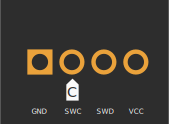

## 软件准备 {#software-prepare}

我们需要用 J-Link 烧录 bootloader，请安装：

* [**JLink v7.94c**](https://www.123pan.com/s/teb2jv-oMR2A.html)（若已安装则忽略）。

安装完成后，打开 `JFlashLite.exe`。

此外，还需要用 QMK Toolbox 为主控烧录固件，请安装：

* [**QMK Toolbox**](https://www.123pan.com/s/teb2jv-sMR2A.html)（若已安装则忽略）。

## 固件下载 {#download-firmware}

以下为 Elysium 焊接板的 bootloader 固件和主控固件，下载后存放在本地。烧录前请仔细核对文件名，不要烧错。

| <Icon icon="fa-brands fa-bootstrap" /> 主控-ST STM32L433 Bootloader | <Icon icon="fa-solid fa-microchip" /> 主控-ST STM32L433 | 备注 |
|---|---| --- |
| <Icon icon="fa-solid fa-circle-down" /> [`bootloader`](https://cdn.shopify.com/s/files/1/0444/8259/2928/files/tinyuf2-elysium.hex?v=1727789734) | <Icon icon="fa-solid fa-circle-down" /> [`1.0.0`](https://cdn.shopify.com/s/files/1/0444/8259/2928/files/helix_elysium_soldered_1.0.0.uf2?v=1727777029) | <Icon icon="fa-solid fa-minus" /> |

## 烧录 bootloader {#flash-bootloader}

:::warning

* J-Link 连接到 Elysium 时， Elysium 须处于通电状态（有 3.3V），否则将无法识别到主控，因此请连接 USB 小板，然后通过USB 为 Elysium 主板供电。

* 主板的右半部分不连接也不会影响烧录。

:::

* 把 J-Link 连接到主板上的烧录口。烧录口线序如下图所示：

> 方块焊盘为 GND，带 <Icon icon="fa-solid fa-copyright" /> 标记的焊盘为 SWC

* 如下图所示，打开 `JFlashLite.exe`，然后在“Device”一栏中选择 `STM32F405RG`。然后点击“OK”。

* 在“Data File (bin /hex /mot/ srec/ ...)”一栏中选择 bootloader 文件所在的路径，然后点击“Program Device”。

## 烧录 STM32 主控固件 {#flash-mcu-firmware}

* 插入 USB 数据线连接到电脑，电脑上应弹出一个名为 `BOOT` 的设备，将主控固件拖入此设备中，完成后该设备会自动弹出。