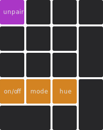

import Tabs from '@theme/Tabs';
import TabItem from '@theme/TabItem';

# 键值表 {#keymap}

## 层 {#layer}

层是现代键盘最重要的功能之一，它可以令按键规模有限的键盘扩展按键数量，也能很好地隐藏那些不常用的功能。

Ankh 键盘最高支持四层，而出厂键值表仅占据了其中两层。

:::info

键盘的层是从“**零**”而不是“一”开始计算的。

**第零层是键盘的初始层**，由字母区、数字区、修饰键等组成。

第一层是次要功能层，由F区、灯光控制等其它次要功能组成。

:::

### 换层 {#layer-switching}

当你按住 Ankh 上的 <kbd>**.**</kbd> 时，键盘将会切换到第一层，松开 <kbd>**.**</kbd> 回到第零层。

### 各层键值 {#keymap-of-each-layer}

<Tabs queryString="pcb-variant">
  <TabItem value="hotswap" label="热插拔" default>

    

    
<Icon icon="fa-solid fa-caret-up" /> 第零层

    

    
<Icon icon="fa-solid fa-caret-up" /> 第一层

    
    

  
 <Icon icon="fa-solid fa-file-circle-question" /> 第一层中，按键颜色所代表的含义

<Icon icon="fa-solid fa-square" style={{color: "#D38322",}} /> 是 `RGB 矩阵调控键`，调节 RGB 灯光的开关、灯效、亮度等参数，详见[RGB 矩阵](/docs-ankh-r2/lighting/rgb-matrix#rgb-matrix-keys)页面。

<Icon icon="fa-solid fa-square" style={{color: "#AA36C6",}} /> 是`删除配对键`，用于在 BLE 模式下删除已配对的设备，详见[BLE 删除配对](/docs-ankh-r2/dual-mode/ble/ble-unpairing)页面。

  </TabItem>
  <TabItem value="soldered" label="焊接">
    
    <Icon icon="fa-solid fa-minus" />

  </TabItem>
</Tabs>