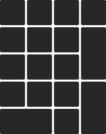

import Tabs from '@theme/Tabs';
import TabItem from '@theme/TabItem';

# 配列 {#layout}

<Tabs queryString="pcb-variant">
  <TabItem value="hotswap" label="热插拔" default>

热插拔版本不具有多配列选项，默认的唯一配列如下图所示：

    

  </TabItem>
  <TabItem value="soldered" label="焊接">
    
    <Icon icon="fa-solid fa-minus" />

  </TabItem>
</Tabs>