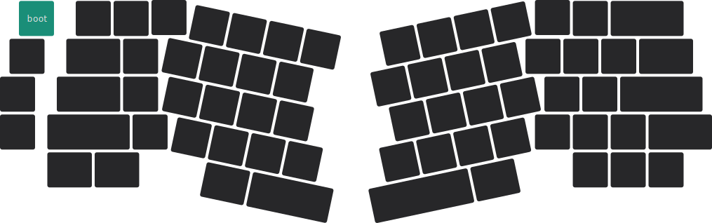

import Tabs from '@theme/Tabs';
import TabItem from '@theme/TabItem';

# 主控固件更新  {#mcu-firmware-update}

固件是键盘的微控制器中运行的程序。新功能的加入或者 bug 的修复都是通过固件更新完成的。

:::tip

固件更新不受固件版本号的限制，可随意越级、降级更新。

:::

:::caution

固件更新后，键盘上存储的个人设置将被全部还原为初始状态，例如 RGB 矩阵设置、VIA 自定义设置等，但 BLE 和 2G4 配对信息不会被清除。

:::

## 更新步骤 {#updating-step}

<Tabs queryString="pcb-variant">
  <TabItem value="hotswap" label="热插拔" default>

 I. 

  从[固件](/docs-elysium/downloads/firmware?pcb-variant=hotswap)页面下载固件。

 II. 

 在你的电脑上下载并安装 QMK Toolbox 软件，若已安装则忽略。

| 版本 | <Icon icon="fa-brands fa-windows" /> Windows | <Icon icon="fa-brands fa-apple" /> macOS |
| --- | --- | --- |
| 0.2.2 | <Icon icon="fa-solid fa-circle-down" />[下载](https://cdn.shopify.com/s/files/1/0444/8259/2928/files/qmk_toolbox.exe) | <Icon icon="fa-solid fa-circle-down" />[下载](https://cdn.shopify.com/s/files/1/0444/8259/2928/files/QMK.Toolbox.pkg) |

 III. 

 打开 QMK Toolbox，在 `Local file` 一栏中载入固件所在的地址。

 IU. 

 将键盘通过 USB 数据线连接到电脑主机，并让键盘进入引导模式，下图所示的绿色按键为引导模式键。

按下组合键 <kbd>**fn**</kbd> + <kbd>**shift**</kbd> + <kbd>**esc**</kbd>，则键盘会进入引导模式。

 UI. 
 如果键盘已经正确进入引导模式，在 QMK Toolbox 中你会看到如下的黄色小字：

 STM32 DFU device connected: STMicroelectronics STM32  BOOTLOADER (0483:DF11:2200) 

 UII. 

 点击 QMK Toolbox 中的 `Flash` 按钮，等待约 10 秒后，烧录即可完成。

  </TabItem>
  <TabItem value="soldered" label="焊接">
    
    <Icon icon="fa-solid fa-hashtag" style={{color: "#cc9e75",}} /> <Icon icon="fa-solid fa-1" style={{color: "#cc9e75",}} />  从[固件](/docs-elysium/downloads/firmware?pcb-variant=soldered)页面下载固件。请检查固件的后缀名，确保为 `.uf2`。

    <Icon icon="fa-solid fa-hashtag" style={{color: "#cc9e75",}} /> <Icon icon="fa-solid fa-2" style={{color: "#cc9e75",}} />  断开 USB 数据线，按住键盘上的 <kbd>**esc**</kbd> 的同时插入 USB 数据线。

    <Icon icon="fa-solid fa-hashtag" style={{color: "#cc9e75",}} /> <Icon icon="fa-solid fa-3" style={{color: "#cc9e75",}} />  你的电脑上会弹出一个名为 `BOOT` 的新卷宗，将固件拖入此卷宗即可完成烧录。

  </TabItem>
</Tabs>