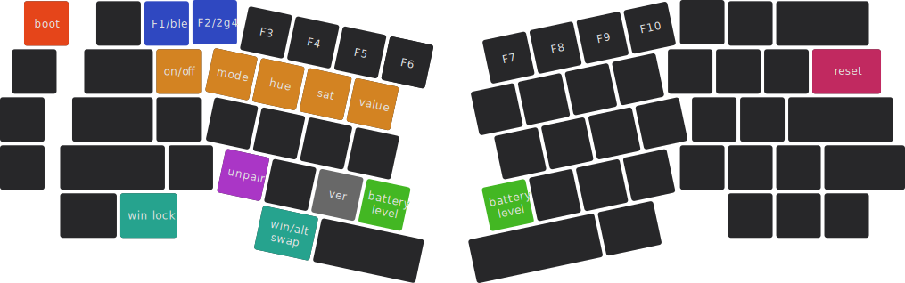

import Tabs from '@theme/Tabs';
import TabItem from '@theme/TabItem';

# 键值表 {#keymap}

## 层 {#layer}

层是现代键盘最重要的功能之一，它可以令按键规模有限的键盘扩展按键数量，也能很好地隐藏那些不常用的功能。

Elysium 键盘最高支持四层，而出厂键值表仅占据了其中两层。

:::info

键盘的层是从“**零**”而不是“一”开始计算的。

**第零层是键盘的初始层**，由字母区、数字区、修饰键等组成。

第一层是次要功能层，由F区、灯光控制等其它次要功能组成。

:::

### 换层 {#layer-switching}

当你按住 Elysium 上的 <kbd>**fn**</kbd> 时，键盘将会切换到第一层，松开 <kbd>**fn**</kbd> 回到第零层。

  
 <Icon icon="fa-solid fa-file-circle-question" /> 为什么 <kbd>**fn**</kbd> 键在 VIA 中显示为“MO(1)”

MO(1) 即 **M**omentarily Turn **o**n Layer **1**，它的意思是只有当我们按住此键时，第一层才会被激活，一旦我们松开，立刻回到原来的层。

除了“MO”之外，还有多种激活某个层的方式，关于这部分内容，请查看 [QMK 文档](https://docs.qmk.fm/#/feature_layers?id=switching-and-toggling-layers)。

### 各层键值 {#keymap-of-each-layer}

<Tabs queryString="pcb-variant">
  <TabItem value="hotswap" label="热插拔" default>

    

    
<Icon icon="fa-solid fa-caret-up" /> 第零层

    

    
<Icon icon="fa-solid fa-caret-up" /> 第一层

    

  
 <Icon icon="fa-solid fa-file-circle-question" /> 第一层中，按键颜色所代表的含义

<Icon icon="fa-solid fa-square" style={{color: "#E5451A",}} /> 是`引导模式键`，用于固件更新，详见 [主控固件更新](/docs-elysium/firmware-update/mcu-firmware-update) 页面。

<Icon icon="fa-solid fa-square" style={{color: "#2F48C1",}} /> 是`无线模式切换键`，用于在 BLE 和 2G4 模式间切换，详见 [切换模式](/docs-elysium/tri-mode/usb-ble-2g4-mode-switch#switch-to-wireless-mode) 页面。

<Icon icon="fa-solid fa-square" style={{color: "#D38322",}} /> 是 `RGB 矩阵调控键`，调节 RGB 灯光的开关、灯效、亮度等参数，详见 [RGB 矩阵](/docs-elysium/lighting/rgb-matrix#rgb-matrix-keys) 页面。

<Icon icon="fa-solid fa-square" style={{color: "#C12960",}} /> 是`无线模式复位键`，用于无线模式工作不正常时复位，详见 [无线模式复位](/docs-elysium/miscellaneous/reset) 页面。

<Icon icon="fa-solid fa-square" style={{color: "#AA36C6",}} /> 是`删除配对键`，用于删除已配对的 BLE 或 2G4 设备，详见 [BLE 删除配对](/docs-elysium/tri-mode/ble/ble-unpairing) 和 [重新配对 2G4 接收器](/docs-elysium/tri-mode/2g4/2g4-re-pairing) 页面。

<Icon icon="fa-solid fa-square" style={{color: "#686868",}} /> 是`固件代号键`，用于查看当前所运行的固件版本，详见 [固件](/docs-elysium/downloads/firmware) 页面。

<Icon icon="fa-solid fa-square" style={{color: "#43B723",}} /> 是`查询电量键`，用于在 2G4 模式下模糊查询剩余电量，详见 [电量百分比](/docs-elysium/battery/battery-soc?mode-variant=2g4#check-battery-soc) 页面。

<Icon icon="fa-solid fa-square" style={{color: "#26A38E",}} /> 是`魔术键`，用于交换或锁定键位，详见 [魔术键位](/docs-elysium/miscellaneous/magic-keycodes) 页面。

  </TabItem>
  <TabItem value="soldered" label="焊接">
    
    

    
<Icon icon="fa-solid fa-caret-up" /> 第零层

    

    
<Icon icon="fa-solid fa-caret-up" /> 第一层

  
 <Icon icon="fa-solid fa-file-circle-question" /> 第一层中，按键颜色所代表的含义

<Icon icon="fa-solid fa-square" style={{color: "#686868",}} /> 是`固件代号键`，用于查看当前所运行的固件版本，详见 [固件](/docs-elysium/downloads/firmware) 页面。

<Icon icon="fa-solid fa-square" style={{color: "#269ED3",}} /> 是`全键无冲键`，用于在六键无冲和全键无冲之间切换，详见 [全键无冲](/docs-elysium/miscellaneous/nkro?pcb-variant=soldered) 页面。

<Icon icon="fa-solid fa-square" style={{color: "#26A38E",}} /> 是`魔术键`，用于交换或锁定键位，详见 [魔术键位](/docs-elysium/miscellaneous/magic-keycodes) 页面。

  </TabItem>
</Tabs>