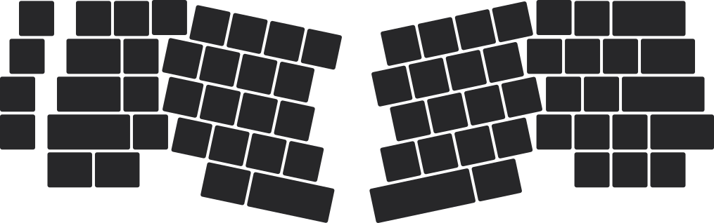
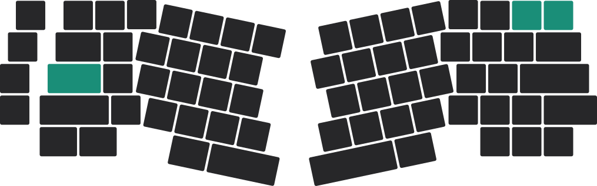
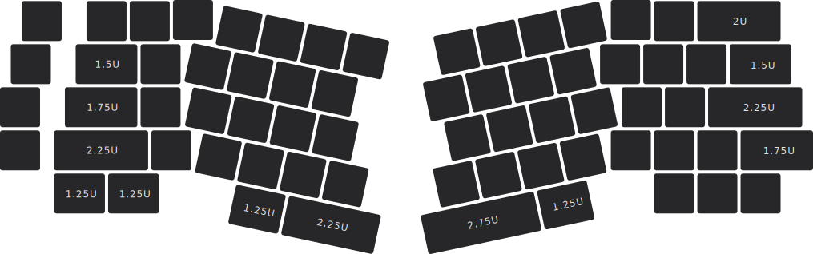

import Tabs from '@theme/Tabs';
import TabItem from '@theme/TabItem';

# 配列 {#layout}

<Tabs queryString="pcb-variant">
  <TabItem value="hotswap" label="热插拔" default>

热插拔版本不具有多配列选项，默认的唯一配列如下图所示：

    

  </TabItem>
  <TabItem value="soldered" label="焊接">

焊接版本默认配列如下图所示：

    

## 多配列选项 {#multi-layout-options}

  多配列选项以下图中的青绿色按键标记：
  * 分裂 backspace
  * 阶梯 caps lock

    

  </TabItem>
</Tabs>

### 键帽 {#keycaps}

键帽长度需求如下图所示（未标注则默认为“1U”）：

:::info

Elysium 需要 5 组长度为 2U 的 PCB 卫星轴。
:::