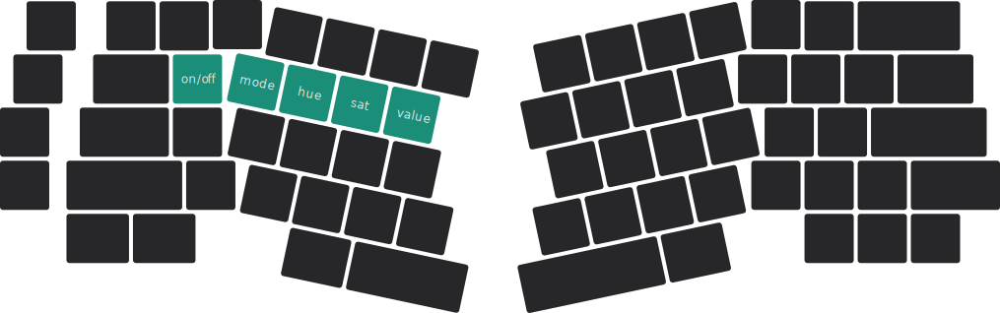

# RGB 矩阵 {#rgb-matrix}

:::note

本页面内容仅适用于 Elysium 热插拔版本。

:::

:::tip

使用电池供电时，打开 RGB 矩阵会大幅缩短电池续航。

为电池充电时，打开 RGB 矩阵可能会延长充满电所需要的时间。

:::

:::danger

在多数情况下，应避免将 RGB 矩阵设定为白色光或近似白色光。

  
 <Icon icon="fa-solid fa-file-circle-question" /> 为什么

    当 RGB 灯珠发出白光时，它的红、绿、蓝三个通道都需要发光以混合出白色光，这将显著提升电流消耗，并可能造成：

    * 键盘消耗的电流超过你的主机的 USB 接口承载能力，导致键盘无法被识别。

    * 电流消耗大于电流输入，导致电池无法充电。

    如果你确实想要白色光，应适当降低其亮度。

:::

---

Elysium 具有 RGB 灯光矩阵，你可以在四十余种左右的灯效中随意切换，同时自定义亮灭、色相、饱和度以及亮度等参数。 

## RGB 矩阵键 {#rgb-matrix-keys}

### 按键位置 {#keycode-position}

下图所示的青绿色按键为 RGB 矩阵的调控键。

### 按键行为 {#keycode-behaviour}

* <kbd>**fn**</kbd> + <kbd>**Q**</kbd> 打开或关闭 RGB 矩阵。

* <kbd>**fn**</kbd> + <kbd>**W**</kbd> 切换至下一种灯效。<kbd>**fn**</kbd> + <kbd>**⇧shift**</kbd> + <kbd>**W**</kbd> 切换至前一种灯效。

* <kbd>**fn**</kbd> + <kbd>**E**</kbd> 偏移色相。<kbd>**fn**</kbd> + <kbd>**⇧shift**</kbd> + <kbd>**E**</kbd> 反向偏移色相。

* <kbd>**fn**</kbd> + <kbd>**R**</kbd> 增加色彩饱和度。<kbd>**fn**</kbd> + <kbd>**⇧shift**</kbd> + <kbd>**R**</kbd> 减弱色彩饱和度。

* <kbd>**fn**</kbd> + <kbd>**T**</kbd> 提升灯光亮度。<kbd>**fn**</kbd> + <kbd>**⇧shift**</kbd> + <kbd>**T**</kbd> 减弱灯光亮度。

  
 <Icon icon="fa-solid fa-file-circle-question" /> 什么是色相、饱和度

色相指的是色彩的倾向，例如彩虹的七种颜色是七种不同的色相。

饱和度指的是色彩的鲜艳程度，饱和度越高，颜色越鲜艳，反之则越接近白色。

例子：

| 颜色 | 色相 | 饱和度 |
| --- | ---| --- |
| <Icon icon="fa-solid fa-square" style={{color: "#00ff1e",}} /> 翠绿色 | 绿 | 最高 |
| <Icon icon="fa-solid fa-square" style={{color: "#3845ff",}} /> 靛蓝色 | 蓝 | 很高 |
| <Icon icon="fa-solid fa-square" style={{color: "#ff7a7a",}} /> 桃红色 | 红 | 中等 |
| <Icon icon="fa-solid fa-square" style={{color: "#f7b8ff",}} /> 淡粉色 | 红 | 很低 |
| <Icon icon="fa-solid fa-square" style={{color: "#ffffff",}} /> 白色 | 无 | 最低 |

## 自动关灯 {#auto-shutdown}

在无按键活动的 20 分钟后，RGB 矩阵会自动关闭。