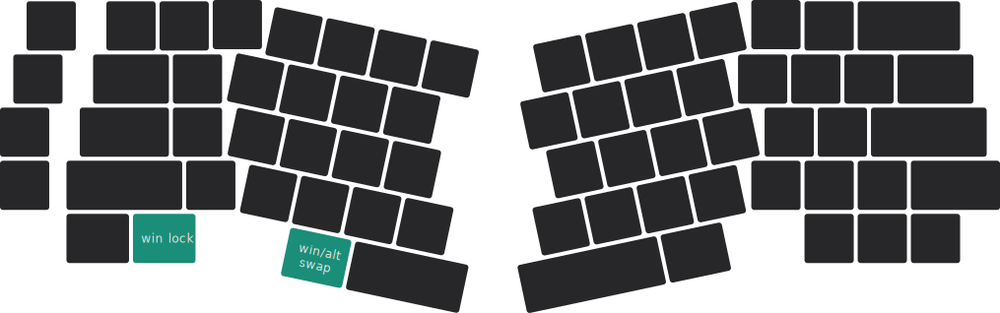

# 魔术键位  {#magic-keycodes}

下图所示的青绿色按键为魔术按键。

## 交换 Left Win 与 Left Alt

按下组合键 <kbd>**fn**</kbd> + <kbd>**shift**</kbd> + <kbd>**Left Alt**</kbd>，则键位上的 Left Win 和 Left Alt 会交换位置。再次按下则解除换位。

  
 <Icon icon="fa-solid fa-file-circle-question" /> 换位的意义

为了符合 macOS 用户的习惯。

## 锁定 Left Win

按下组合键 <kbd>**fn**</kbd> + <kbd>**shift**</kbd> + <kbd>**Left Win**</kbd>，则键位上的 Left Win 会被禁止使用。再次按下则取消此限制。

  
 <Icon icon="fa-solid fa-file-circle-question" /> 锁定的意义

防止游戏或工作时误触 Win 键。

