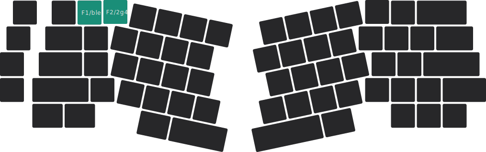

# 切换模式 {#mode-switch}

:::note

本页面内容仅适用于 Elysium 热插拔版本。

:::

---

Elysium 支持三种连接模式：

有线模式： USB <Icon icon="fa-brands fa-usb" />

无线模式： BLE <Icon icon="fa-brands fa-bluetooth" style={{color: "#74C0FC",}} />、2G4 <Icon icon="fa-solid fa-wifi" />

:::tip

如果你不想使用无线模式，可以断开电池排线的连接，或关闭电池开关 [<Icon icon="fa-solid fa-compass" /> 怎么做？](/docs-elysium/battery/battery-switch)。

:::

## 切换到 USB 有线模式 {#switch-to-usb-mode}

在任何情况下，只需用 USB 数据线把 Elysium 连接至电脑，即可切换到有线模式。

## 切换到无线模式 {#switch-to-wireless-mode}

当 USB 数据线**未连接**时，Elysium 会自动切换到无线模式。在无线模式下，键盘通过内置电池供电，因此需要把电池开关推至 **ON** [<Icon icon="fa-solid fa-compass" /> 怎么做？](/docs-elysium/battery/battery-switch)。

下图所示的青绿色按键为无线模式选择键，请按下对应的键来切换 BLE 或 2G4 模式：

### 切换到 BLE 无线模式 {#switch-to-ble-mode}

* 长按 <kbd>**fn**</kbd> + <kbd>**1**</kbd> 3 秒左右。

### 切换到 2G4 无线模式 {#switch-to-2g4-mode}

* 长按 <kbd>**fn**</kbd> + <kbd>**2**</kbd> 3 秒左右。

:::note

如果长按 <kbd>**fn**</kbd> + <kbd>**1**</kbd> / <kbd>**fn**</kbd> + <kbd>**2**</kbd> 时间未达到指定秒数，那么将视为按下 <kbd>**F1**</kbd> / <kbd>**F2**</kbd>。

:::

