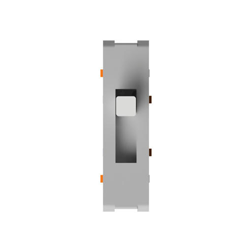
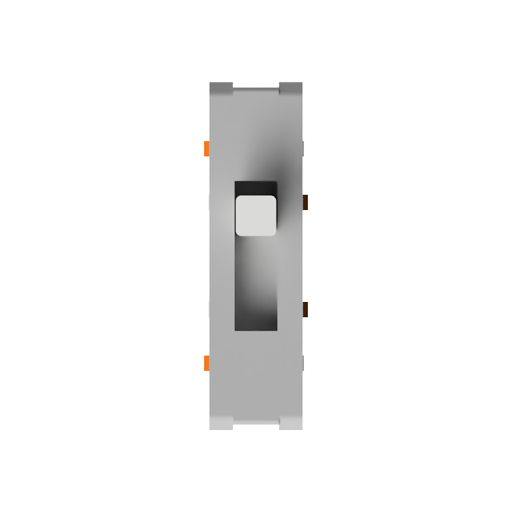
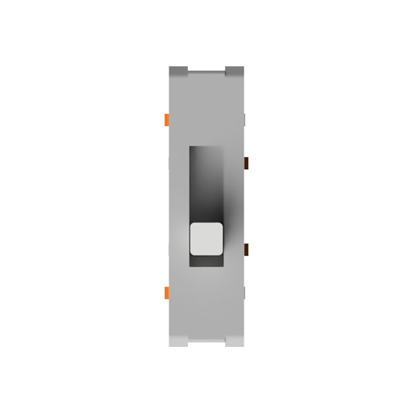
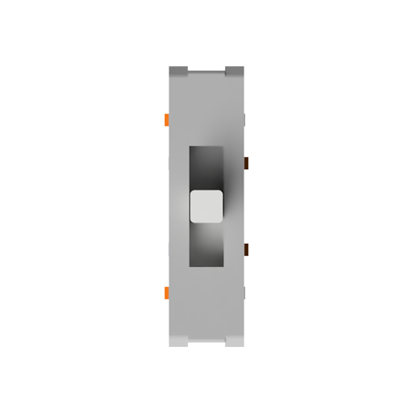

# 切换模式 {#mode-switch}

:::note

本页面内容仅适用于 Elysium 热插拔版本。

:::

---

Elysium 支持 USB 有线模式、2G4 无线模式以及蓝牙 LE（BLE）无线模式。

## 切换到 USB 有线模式 {#switch-to-usb-mode}

在任何情况下，只需用 USB 数据线把 Elysium 连接至电脑，即可切换到有线模式。详见 [USB](/docs-elysium/tri-mode/usb) 页面。

## 切换到无线模式 {#switch-to-wireless-mode}

由于在无线模式下，必须通过电池为键盘供电，因此需要把电池开关推至 **ON** [<Icon icon="fa-solid fa-compass" /> 怎么做？](/docs-elysium/battery/battery-switch)，当 USB 数据线**未连接**时，Elysium 会自动切换到无线模式。用户可以通过`无线模式选择器`来选择 BLE 或 2G4 模式。

下图为 Elysium 热插拔版本 PCB，图中的红色元件即`无线模式选择器`。

如下图所示，选择器有三种档位，通过轻轻拨动操纵杆来选择档位。

### 选择 BLE 无线模式 {#select-ble-mode}

当无线模式选择器推至最上方时，选择 BLE 无线模式。详见 [BLE](/docs-elysium/tri-mode/ble) 页面。

### 选择 2G4 无线模式 {#select-2g4-mode}

当无线模式选择器推至最下方时，选择 2G4 无线模式。详见 [2G4](/docs-elysium/tri-mode/2g4) 页面。

### 通过按键选择无线模式 {#select-mode-via-keys}

当无线模式选择器推至中间时，你可以通过按键来选择无线模式。

下图所示的青绿色按键为无线模式选择键。

* <kbd>**fn**</kbd> + <kbd>**Page Up**</kbd> 选择 BLE 无线模式。
* <kbd>**fn**</kbd> + <kbd>**Page Down**</kbd> 选择 2G4 无线模式。

